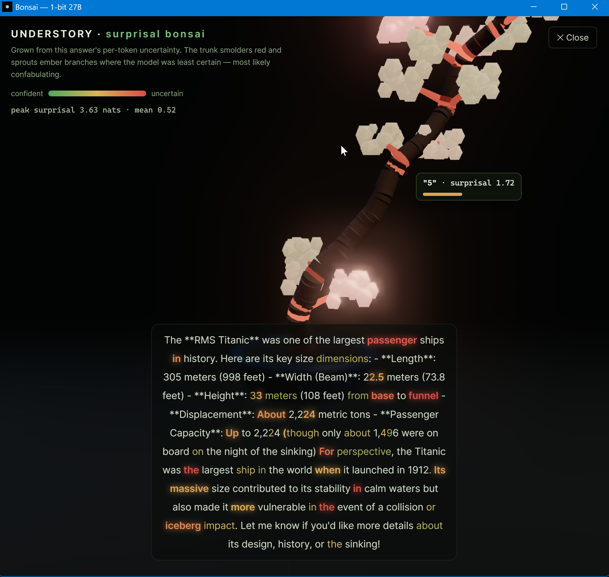

# Bonsai — native desktop chat for the local 1-bit Bonsai-27B

A small, fast, **browser-free** desktop app (Tauri + React) that runs the
**1-bit Bonsai-27B** model — a 27B-class reasoning model in ~3.8 GB — entirely
on your own GPU via the PrismML build of llama.cpp. No LM Studio, no web browser,
no cloud. Launch one `.exe`, get a native chat window.

 ·
1.125 bits/weight · 262K context · RTX-class GPU



> **The 🌳 Tree view** grows a bonsai from the answer's own logprobs — the trunk
> smolders red and sprouts glowing ember-branches *exactly* where the model was
> least certain (i.e. most likely confabulating), and stays smooth green where it
> was confident. Above — in the app's **native window** (title bar and all, no
> browser) — the model hedging on the Titanic's dimensions, every figure lit
> amber-red; hovering a branch reads back its token. It's the visual dual of
> "don't trust model-authored facts": the gnarls tell you where to point a check.

---

## What it is

- **Frontend:** React + Vite + Tailwind, rendered in a native WebView (Tauri v2)
  — a real window, not a browser tab.
- **Backend:** a Rust (Tauri) core that spawns and supervises a local
  `llama-server` (PrismML fork, CUDA), health-checks it, and streams chat
  completions over its OpenAI-compatible HTTP API.
- **Model:** `Bonsai-27B-Q1_0.gguf` (the "Q1_0_g128" 1-bit hybrid-attention pack
  from [prism-ml/Bonsai-27B-gguf](https://huggingface.co/prism-ml/Bonsai-27B-gguf)),
  derived from Qwen3.6-27B.

### Features
- Live **token streaming** with a stop button.
- **Thinking mode** toggle — Bonsai reasons first (shown in a collapsible,
  live "Reasoning" panel) then answers. Turn off for instant direct replies.
- **Per-token uncertainty readout** — each answer shows a peak-surprisal dot
  (green → amber → red) computed from the model's own streamed logprobs. It
  turns red exactly where the model was least certain (and most likely
  confabulating). Measured, not inferred.
- **🌳 Uncertainty tree** — a live 3D "surprisal bonsai" (Three.js, bundled) grown
  from the answer's per-token logprobs: confident text is smooth green wood; the
  trunk smolders red with ember-branches where the model was guessing. Hover a
  branch to read its token; grows live as the model streams. Nothing is
  decoration — the geometry *is* the signal.
- Markdown + fenced **code blocks** with one-click copy.
- Adjustable sampling (temperature / top-p / top-k / max tokens) and a custom
  system prompt.
- Conversation + settings persist across restarts (local `localStorage`).

### Robustness
- **Crash-safe:** the llama-server runs inside a Windows Job Object flagged
  kill-on-close, so if the app crashes or is force-quit the server dies with it
  — no orphaned process holding VRAM.
- **Single-instance:** a second launch focuses the existing window instead of
  opening a duplicate app + sidecar.
- **Server identity check:** if something is already on `:8080`, the app
  verifies via `/v1/models` that it's actually serving Bonsai before attaching;
  otherwise it spawns its own on a free port (no silently talking to a stray
  LM Studio / Ollama / different model).

---

## Requirements (already provisioned on this machine)

| Piece | Location |
| :---- | :------- |
| PrismML llama.cpp build (CUDA, Q1_0 kernels) | `C:\llama.cpp-bonsai\llama-server.exe` |
| 1-bit model weights (~3.8 GB) | `C:\models\Bonsai-27B-Q1_0.gguf` |
| NVIDIA GPU (used: RTX 4070 Ti SUPER, 16 GB) | CUDA driver |

Both paths can be overridden with the `BONSAI_LLAMA_SERVER` and `BONSAI_MODEL`
environment variables.

---

## Run it

**Simplest:** double-click **`Launch Bonsai.cmd`** (runs the built app), or run
the installer / portable exe produced by the build (see below).

### From source
```powershell
pnpm install
pnpm tauri dev      # hot-reload dev window
# or produce a distributable:
pnpm tauri build    # -> src-tauri/target/release/bonsai.exe
                    #    + installer at target/release/bundle/nsis/
```

---

## How the pieces connect

```
 ┌─────────────────────────────┐        HTTP /v1/chat/completions (SSE)
 │  Bonsai.exe (Tauri window)   │  ───────────────────────────────────────┐
 │  React UI  ◄─ events ─ Rust  │                                          ▼
 │            core (sidecar)    │      ┌───────────────────────────────────────────┐
 │                              │ spawn│ C:\llama.cpp-bonsai\llama-server.exe        │
 │                              │─────►│  --model C:\models\Bonsai-27B-Q1_0.gguf     │
 └─────────────────────────────┘      │  --ctx-size 16384 -ngl 99 --jinja  (:8080)  │
                                       │  PrismML Q1_0_g128 hybrid-attention kernels │
                                       └───────────────────────────────────────────┘
                                                     ▼ NVIDIA GPU (CUDA)
```

## Layout
```
src/                 React UI (components, store, ipc, markdown)
src-tauri/src/
  main.rs            app + state + server lifecycle (spawn / reuse / kill)
  sidecar.rs         locate + launch llama-server, health-wait
  llama_client.rs    OpenAI-compat streaming (reasoning + answer channels)
  commands.rs        send_message / stop_generation / get_status
  think_strip.rs     defensive <think> stripping
```

Built 2026-07-17. Reuses the proven llama-server sidecar + streaming patterns
from `C:\DAVE` (a sibling Tauri chat app), retargeted to the Bonsai stack.
